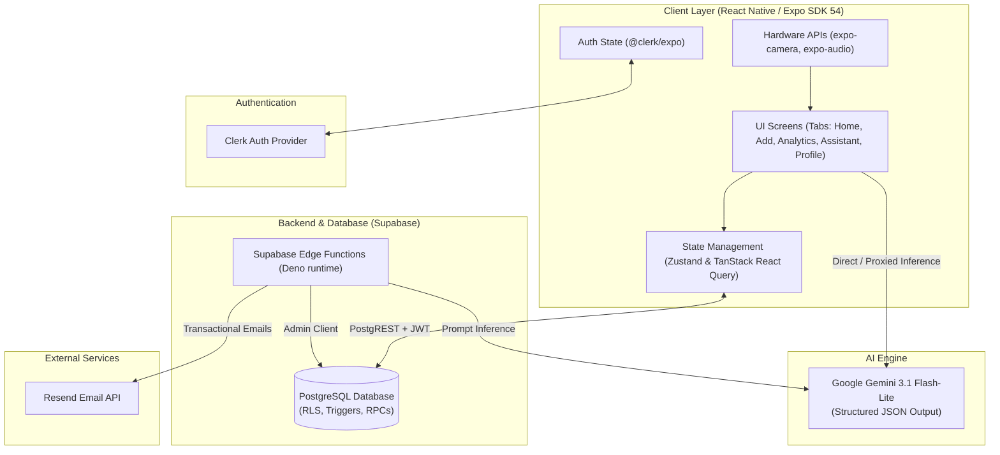
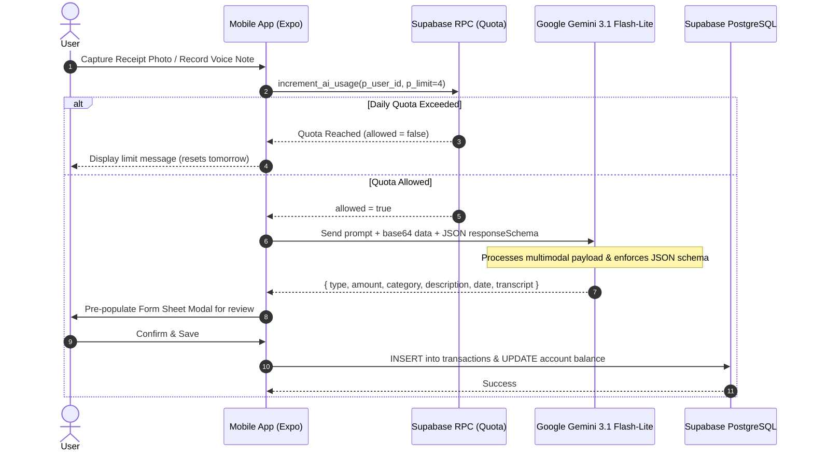
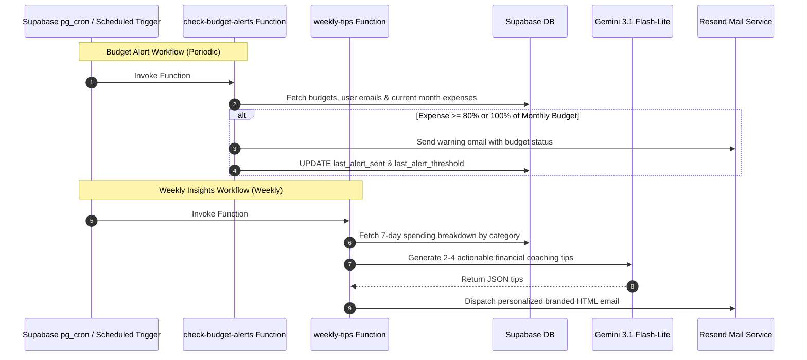

# Vittarox 💸 — AI-Powered Personal Finance & Expense Tracker

> **Effortless, intelligent personal finance built for the modern mobile era.**  
> Track expenses without friction using Multimodal Receipt OCR, Voice Logging, and a Context-Aware AI Financial Assistant.

---

## 📑 Table of Contents

- [Overview](#-overview)
- [Key Features](#-key-features)
- [System Architecture](#-system-architecture)
  - [High-Level Architecture](#high-level-architecture)
  - [AI Ingestion Flow (Receipt & Voice)](#ai-ingestion-flow-receipt--voice)
  - [Automated Intelligence & Alerting Flow](#automated-intelligence--alerting-flow)
- [Tech Stack](#-tech-stack)
- [Database & Security Architecture](#-database--security-architecture)
  - [Entity Relationship Overview](#entity-relationship-overview)
  - [Row Level Security (RLS) & Guardrails](#row-level-security-rls--guardrails)
- [Supabase Edge Functions](#-supabase-edge-functions)
- [Project Directory Structure](#-project-directory-structure)
- [Getting Started](#-getting-started)
  - [Prerequisites](#prerequisites)
  - [Installation](#installation)
  - [Environment Variables](#environment-variables)
  - [Running the App](#running-the-app)
- [API & AI Specification](#-api--ai-specification)
- [License & Acknowledgments](#-license--acknowledgments)

---

## 🌟 Overview

Most expense tracking applications fail because manual data entry creates friction. Users forget to enter daily purchases, struggle to categorize items correctly, and lose track of physical receipts.

**Vittarox** solves this by removing manual friction completely:
- **Zero-typing entry:** Capture receipts with your camera or speak your transactions naturally.
- **Structured intelligence:** Google Gemini transforms unstructured images and audio into strongly typed database records.
- **Context-aware coaching:** Instead of static graphs, chat with an AI assistant that understands your spending patterns, budgets, and habits.
- **Proactive alerts:** Automated serverless cron functions monitor your thresholds and send personalized weekly tips via email.

---

## ✨ Key Features

### 1. 📸 Multimodal Receipt Scanner
- Capture photos with the device camera or pick from the gallery.
- Images are encoded as base64 and analyzed using **Google Gemini 3.1 Flash-Lite** with strict JSON Schema constraints.
- Automatically extracts: **Merchant Name**, **Total Amount**, **Expense Category**, and **Transaction Date**.

### 2. 🎙️ Natural Voice Expense Logging
- Tap to record voice notes (e.g., *"Spent 450 on coffee and snacks yesterday"* or *"Received 15000 freelance payment today"*).
- Resolves relative time words (*"today"*, *"yesterday"*, *"last Monday"*) into ISO dates based on the current timestamp.
- Automatically categorizes the item into `EXPENSE` or `INCOME`, populates the transcription, and flags edge cases.

### 3. 🤖 Context-Aware AI Financial Assistant
- In-app interactive conversational assistant.
- Dynamically ingests the user's active currency, set budget, and transactions from the past 30 days as context.
- Answers queries like:
  - *"How much did I spend on dining out this month?"*
  - *"What was my single biggest expense this week?"*
  - *"Am I in danger of exceeding my budget?"*

### 4. 📊 Analytics, Budgets & Multi-Account Support
- **Multi-Account:** Manage `CASH`, `BANK`, `CREDIT_CARD`, and `SAVINGS` accounts with balances and default assignment.
- **Visual Analytics:** Interactive graphs powered by `react-native-gifted-charts`.
- **Monthly Budgets:** Visual progress bars with category breakdowns.
- **Multi-Currency:** Dynamic currency code and symbol configuration with instant UI updates.

### 5. 🛡️ Production Safeguards & AI Rate Limiting
- **Daily AI Quota:** Database-enforced atomic counters (`rpc/increment_ai_usage`) prevent API abuse.
- **Fail-Open Strategy:** If the quota check encounters a transient network glitch, user transactions remain uninterrupted.
- **Resilient Retries:** Exponential backoff with jitter on HTTP `429` (rate-limit) and `503` (service unavailable) responses.

---

## 🏗️ System Architecture

### High-Level Architecture



---

### AI Ingestion Flow (Receipt & Voice)



---

### Automated Intelligence & Alerting Flow



---

## 💻 Tech Stack

| Domain | Technology / Library | Version | Description |
| :--- | :--- | :--- | :--- |
| **Framework** | [Expo](https://expo.dev) | `^54.0.36` | Managed React Native workflow with file-based routing |
| **Language** | [TypeScript](https://www.typescriptlang.org/) | `^5.9.2` | End-to-end static typing |
| **Navigation** | [Expo Router](https://docs.expo.dev/router/introduction/) | `^6.0.24` | Typed, file-system-based routing |
| **Styling** | [NativeWind](https://www.nativewind.dev/) (Tailwind CSS) | `^4.2.6` | Utility-first universal mobile styling |
| **Authentication** | [@clerk/expo](https://clerk.com/) | `^4.6.6` | User authentication, sessions, and secure onboarding |
| **Database & Auth** | [Supabase](https://supabase.com/) | `^2.109.0` | PostgreSQL, Row Level Security, RPCs, Edge Functions |
| **State Management** | [Zustand](https://zustand.docs.pmnd.rs/) | `^5.0.15` | Minimalist client-side application state |
| **Server State / Cache** | [TanStack React Query](https://tanstack.com/query/latest) | `^5.103.0` | Server-state caching, background revalidation & mutations |
| **AI / Multimodal** | [Google Gemini 3.1 Flash-Lite](https://ai.google.dev/) | Beta v1 | High-speed multimodal inference with JSON Schema output |
| **Data Visualization** | `react-native-gifted-charts` | `^1.4.78` | Interactive bar, line, and pie charts |
| **Validation** | [Zod](https://zod.dev/) | `^4.6.2` | Runtime schema validation |
| **Email Delivery** | [Resend](https://resend.com/) | Edge SDK | Transactional emails for budget alerts & weekly coaching |

---

## 🗄️ Database & Security Architecture

### Entity Relationship Overview

```text
               +-------------------+
               |       users       |
               +-------------------+
               | id (PK)           |
               | clerk_id (Unique) |
               | email             |
               | name              |
               | currency          |
               | created_at        |
               +-------------------+
                         |
       +-----------------+-----------------+
       | 1:N                               | 1:1
       v                                   v
+-------------------+             +-----------------------+
|     accounts      |             |        budgets        |
+-------------------+             +-----------------------+
| id (PK)           |             | id (PK)               |
| user_id (FK)      |             | user_id (FK, Unique)  |
| name              |             | amount                |
| type (Enum)       |             | last_alert_sent       |
| balance           |             | last_alert_threshold  |
| is_default        |             | updated_at            |
+-------------------+             +-----------------------+
       | 1:N
       v
+-------------------+             +-----------------------+
|   transactions    |             |       ai_usage        |
+-------------------+             +-----------------------+
| id (PK)           |             | id (PK)               |
| user_id (FK)      |             | user_id (FK)          |
| account_id (FK)   |             | usage_date (Date)     |
| type (Enum)       |             | request_count         |
| amount            |             | updated_at            |
| category (Enum)   |             +-----------------------+
| description       |
| date (Date)       |
| input_method      |
| voice_transcript  |
| is_flagged        |
| flag_reason       |
+-------------------+
```

### Row Level Security (RLS) & Guardrails

All database tables have **Row Level Security enabled** by default. Data isolation is enforced at the database layer:

- **Users:** Can only read and modify their own records (`auth.uid() = user_id` / `clerk_id`).
- **Accounts:** Cascading soft checks ensure that deleting a transaction reconciles the parent account's balance accurately.
- **AI Rate Limiting (Atomic RPC):**
  ```sql
  -- Atomic stored procedure preventing race conditions on AI requests
  CREATE OR REPLACE FUNCTION increment_ai_usage(p_user_id TEXT, p_limit INT)
  RETURNS BOOLEAN AS $$
  DECLARE
      v_count INT;
  BEGIN
      INSERT INTO ai_usage (user_id, usage_date, request_count)
      VALUES (p_user_id, CURRENT_DATE, 1)
      ON CONFLICT (user_id, usage_date)
      DO UPDATE SET request_count = ai_usage.request_count + 1
      RETURNING request_count INTO v_count;

      RETURN v_count <= p_limit;
  END;
  $$ LANGUAGE plpgsql SECURITY DEFINER;
  ```

---

## ⚡ Supabase Edge Functions

Vittarox includes three automated serverless Edge Functions (built on Deno):

1. **`gemini-proxy`** (`supabase/functions/gemini-proxy`):  
   Acts as a secure backend gateway to call Google Gemini without exposing API keys directly to the client bundle when proxying is preferred. Supports structured JSON generation schemas and multimodal payloads.

2. **`check-budget-alerts`** (`supabase/functions/check-budget-alerts`):  
   Scheduled via cron to inspect monthly spending against user budgets. If spending crosses `80%` or `100%`, it sends a warning email via Resend and updates tracking thresholds.

3. **`weekly-tips`** (`supabase/functions/weekly-tips`):  
   Analyzes the past 7 days of income and expense metrics for each user, prompts Gemini to craft 2–4 bite-sized actionable coaching tips, and emails them in a responsive HTML layout.

---

## 📂 Project Directory Structure

```text
Vittarox/
├── app/                              # Expo Router file-based route definitions
│   ├── (auth)/                       # Authentication screens (Clerk)
│   │   ├── _layout.tsx
│   │   ├── sign-in.tsx               # Login screen
│   │   └── sign-up.tsx               # Registration screen
│   ├── (root)/
│   │   ├── (tabs)/                   # Bottom tab navigators
│   │   │   ├── _layout.tsx           # Tab bar styling and icon configuration
│   │   │   ├── index.tsx             # Home dashboard (Metrics, Recent activity)
│   │   │   ├── transactions.tsx      # Filterable transaction history & search
│   │   │   ├── add-transaction.tsx   # Transaction creator (Manual, Receipt, Voice)
│   │   │   ├── assistant.tsx         # AI conversational financial assistant
│   │   │   └── profile.tsx           # Profile, Currency & Account preferences
│   │   ├── _layout.tsx
│   │   └── onboarding.tsx            # First-time user currency & setup flow
│   ├── _layout.tsx                   # Root application providers (Clerk, QueryClient)
│   └── index.tsx                     # Entrypoint & auth redirect router
├── components/                       # Modular UI Components
│   ├── AccountModal.tsx              # Create & switch financial accounts
│   ├── AIActionCard.tsx              # Interactive cards for AI recommendations
│   ├── BudgetModal.tsx               # Set & update monthly budget targets
│   ├── CalenderPicker.tsx            # Date selection component
│   ├── CurrencyPicker.tsx            # Currency selection modal
│   ├── FormSheetModal.tsx            # Bottom sheet wrapper for forms
│   ├── GradientIconButton.tsx        # Styled action buttons with gradients
│   ├── PillGroup.tsx                 # Category and filter selection pills
│   ├── ReceiptScannerModal.tsx       # Camera & picker modal for receipt OCR
│   ├── TransactionRow.tsx            # Render row for transaction lists
│   └── VoiceRecorderModal.tsx        # Voice recording & transcription modal
├── constants/                        # Theme, categories & static assets
│   ├── categories.ts                 # Expense/Income category definitions & icons
│   └── theme.ts
├── hooks/                            # Custom React Hooks
│   ├── mutations/                    # TanStack Query mutations (create/delete tx)
│   ├── queries/                      # TanStack Query query hooks (transactions, budget)
│   ├── useSupabase.ts                # Authenticated Supabase client instance
│   └── useUserSync.ts                # Clerk to Supabase profile sync hook
├── lib/                              # Core libraries & business services
│   ├── services/
│   │   ├── accounts.ts               # Account CRUD logic
│   │   ├── aiUsage.ts                # AI usage quota validation
│   │   ├── assistant.ts              # Gemini chat reasoning & prompt builder
│   │   ├── budgets.ts                # Budget upsert & query logic
│   │   ├── extractTransaction.ts     # Gemini receipt vision & voice transcription
│   │   └── transactions.ts           # Transaction filtering & balance reconciliation
│   ├── supabase.ts                   # Supabase client bootstrap
│   └── utils.ts                      # Formatters (currency, numbers, dates)
├── store/                            # Zustand stores
│   └── userStore.ts                  # Client-side user currency & settings store
├── supabase/                         # Supabase configuration & Edge functions
│   ├── config.toml                   # Local Supabase configuration
│   └── functions/
│       ├── _shared/                  # Shared Resend & email layout helpers
│       ├── check-budget-alerts/      # Automated budget alerts cron function
│       ├── gemini-proxy/             # Secure Gemini API reverse proxy
│       └── weekly-tips/              # Automated weekly financial coaching cron
├── tailwind.config.js                # Tailwind CSS / NativeWind theme config
├── tsconfig.json                     # TypeScript compiler configuration
└── package.json                      # Project dependencies and run scripts
```

---

## 🚀 Getting Started

### Prerequisites

- **Node.js** >= 18.0.0
- **npm** or **yarn** / **bun**
- **Expo Go** app on your physical mobile device, or an iOS Simulator / Android Emulator
- Accounts & API keys for:
  - [Google AI Studio](https://aistudio.google.com/) (Gemini API)
  - [Supabase](https://supabase.com/) (Database & Edge Functions)
  - [Clerk](https://clerk.com/) (Authentication)
  - [Resend](https://resend.com/) (Email alerts, optional for local app testing)

---

### Installation

1. **Clone the repository:**
   ```bash
   git clone https://github.com/Manishthakur99/Vittarox-AI_Finance_App.git
   cd Vittarox
   ```

2. **Install dependencies:**
   ```bash
   npm install
   ```

---

### Environment Variables

Create a `.env` file in the root of the project:

```env
# Clerk Authentication
EXPO_PUBLIC_CLERK_PUBLISHABLE_KEY=pk_test_your_clerk_key

# Supabase Backend
EXPO_PUBLIC_SUPABASE_URL=https://your-project.supabase.co
EXPO_PUBLIC_SUPABASE_KEY=your_supabase_anon_key

# Google Gemini AI
EXPO_PUBLIC_GEMINI_API_KEY=your_gemini_api_key
```

For Supabase Edge Functions, set the following secrets via the Supabase CLI or dashboard:

```bash
supabase secrets set GEMINI_API_KEY=your_gemini_api_key
supabase secrets set RESEND_API_KEY=your_resend_api_key
supabase secrets set FROM_EMAIL="alerts@yourdomain.com"
```

---

### Running the App

```bash
# Start the Expo development server
npx expo start

# Run directly on Android
npx expo start --android

# Run directly on iOS simulator (macOS required)
npx expo start --ios

# Run in web browser
npx expo start --web
```

Scan the QR code printed in the terminal using the **Expo Go** app on iOS or Android.

---

## 🔍 API & AI Specification

### 1. Receipt OCR Prompting
The multimodal parser instructs `gemini-3.1-flash-lite` to extract transaction properties with a strict schema:

```typescript
const RESPONSE_SCHEMA = {
  type: "object",
  properties: {
    type: { type: "string", enum: ["EXPENSE", "INCOME"], nullable: true },
    amount: { type: "number", nullable: true },
    category: {
      type: "string",
      enum: [...CATEGORY_KEYS_EXPENSE, ...CATEGORY_KEYS_INCOME],
      nullable: true,
    },
    description: { type: "string", nullable: true },
    date: { type: "string", nullable: true },
    transcript: { type: "string", nullable: true },
  },
  required: ["type", "amount", "category", "description", "date", "transcript"],
};
```

### 2. Audio Voice Ingestion
The audio input is recorded using `expo-audio` as `m4a`/`aac`, converted to base64, and dispatched with an anchor date (`today`) so that references like *"yesterday"* or *"day before yesterday"* are resolved directly into valid `YYYY-MM-DD` stamps.

---

## 📄 License & Acknowledgments

- **Author:** [Manish Thakur](https://github.com/Manishthakur99)
- **License:** MIT License
- Built with [Expo](https://expo.dev), [Supabase](https://supabase.com), [Clerk](https://clerk.com), and [Google Gemini](https://ai.google.dev/).
